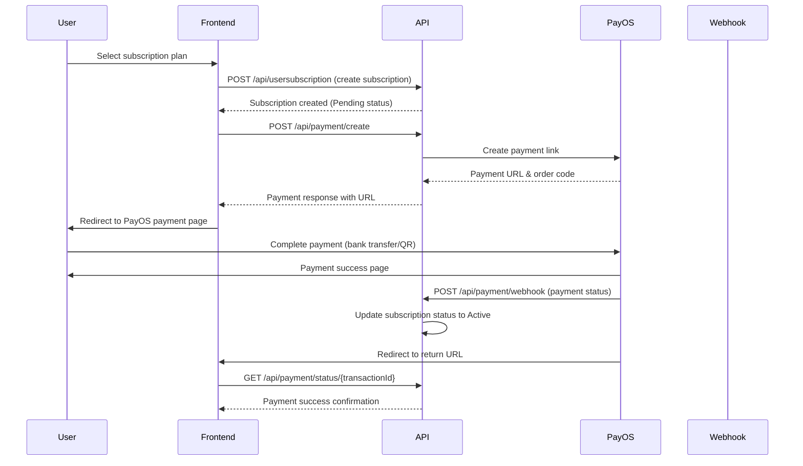

# Payment API Guide

## Overview

This guide covers the DrHan Payment API endpoints powered by PayOS, a Vietnamese payment gateway. The API provides comprehensive payment processing capabilities including payment creation, status tracking, cancellation, and webhook handling for subscription payments.

**Base URL:** `/api/payment`  
**Payment Gateway:** PayOS (Vietnamese payment gateway)  
**Supported Methods:** Bank transfers, QR code payments, Credit cards

---

## Table of Contents

1. [Authentication](#authentication)
2. [Configuration](#configuration)
3. [Payment Endpoints](#payment-endpoints)
4. [Webhook Integration](#webhook-integration)
5. [Data Models](#data-models)
6. [Payment Flow](#payment-flow)
7. [Error Handling](#error-handling)
8. [Testing](#testing)

---

## Authentication

Most payment endpoints require JWT authentication. Include the bearer token in the Authorization header:

```
Authorization: Bearer YOUR_JWT_TOKEN
```

**Public endpoints (no auth required):**
- Webhook endpoint
- Return/Cancel handlers

---

## Configuration

### Environment Setup

Add the following configuration to your `appsettings.json`:

```json
{
  "PayOS": {
    "ClientId": "your-payos-client-id",
    "ApiKey": "your-payos-api-key", 
    "ChecksumKey": "your-payos-checksum-key",
    "BaseUrl": "https://api-merchant.payos.vn",
    "ReturnUrl": front-end payment return page,
    "CancelUrl": "front-end payment cancelled page"
  }
}
```

### Required Credentials

Obtain from PayOS dashboard:
- **ClientId**: Your PayOS client identifier
- **ApiKey**: API key for authentication
- **ChecksumKey**: For signature verification
- **ReturnUrl**: Success callback URL
- **CancelUrl**: Cancellation callback URL

---

## Payment Endpoints

### 1. Create Payment

Create a new payment link with PayOS.

**Endpoint:** `POST /api/payment/create`  
**Auth Required:** ✅ Bearer Token

#### Request Body

```json
{
  "amount": 99000.00,
  "description": "Premium Plan - Monthly Subscription",
  "userSubscriptionId": 123,
    "ReturnUrl": front-end payment return page,
    "CancelUrl": "front-end payment cancelled page"
}
```

#### Response

```json
{
  "isSucceeded": true,
  "data": {
    "id": 1,
    "amount": 99000.00,
    "currency": "VND",
    "transactionId": "1703123456",
    "paymentStatus": "Pending",
    "paymentMethod": "PAYOS",
    "paymentDate": "2024-01-15T10:30:00Z",
    "failureReason": null,
    "paymentUrl": "https://pay.payos.vn/web/12345678-abcd-efgh-ijkl-123456789012",
    "userSubscriptionId": 123
  },
  "message": "Payment created successfully"
}
```

#### Field Descriptions

- `amount`: Payment amount (VND)
- `description`: Payment description (shown to user)
- `userSubscriptionId`: Related subscription ID
- `returnUrl`: Optional custom return URL
- `cancelUrl`: Optional custom cancel URL
- `paymentUrl`: Direct link to PayOS payment page


### 3. Get Payment Status

Retrieve the current status of a payment by transaction ID.

**Endpoint:** `GET /api/payment/status/{transactionId}`  
**Auth Required:** ✅ Bearer Token

#### Response

```json
{
  "isSucceeded": true,
  "data": {
    "id": 1,
    "amount": 99000.00,
    "currency": "VND",
    "transactionId": "1703123456",
    "paymentStatus": "Success",
    "paymentMethod": "PAYOS",
    "paymentDate": "2024-01-15T10:35:00Z",
    "failureReason": null,
    "paymentUrl": null,
    "userSubscriptionId": 123
  }
}
```

#### Status Values

- **Pending**: Payment created, awaiting user action
- **Success**: Payment completed successfully
- **Failed**: Payment failed or was rejected

### 4. Cancel Payment

Cancel a pending payment.

**Endpoint:** `POST /api/payment/cancel/{transactionId}`  
**Auth Required:** ✅ Bearer Token

#### Response

```json
{
  "isSucceeded": true,
  "data": true,
  "message": "Payment cancelled successfully"
}
```

**Note:** Only pending payments can be cancelled.

### 5. Payment Return Handler

Handles successful payment returns from PayOS (user redirected here after payment).

**Endpoint:** `GET /api/payment/return?orderCode={orderCode}&status={status}`  
**Auth Required:** ❌ (Public callback)

#### Parameters

- `orderCode`: PayOS order code
- `status`: Payment status ("paid", "cancelled", etc.)

#### Response

```json
{
  "isSucceeded": true,
  "data": {
    "id": 1,
    "amount": 99000.00,
    "currency": "VND",
    "transactionId": "1703123456",
    "paymentStatus": "Success",
    "paymentMethod": "PAYOS",
    "paymentDate": "2024-01-15T10:35:00Z",
    "userSubscriptionId": 123
  }
}
```

### 6. Payment Cancel Handler

Handles payment cancellation returns from PayOS.

**Endpoint:** `GET /api/payment/cancel?orderCode={orderCode}`  
**Auth Required:** ❌ (Public callback)

#### Response

```json
{
  "isSucceeded": true,
  "data": {
    "id": 1,
    "transactionId": "1703123456",
    "paymentStatus": "Failed",
    "failureReason": "User cancelled payment"
  }
}
```

---

## Webhook Integration

### Webhook Endpoint

PayOS sends real-time payment status updates to your webhook endpoint.

**Endpoint:** `POST /api/payment/webhook`  
**Auth Required:** ❌ (Secured by signature verification)

#### Webhook Request Body

```json
{
  "code": "00",
  "desc": "success",
  "success": true,
  "data": {
    "orderCode": 1703123456,
    "amount": 99000,
    "description": "Premium Plan - Monthly Subscription",
    "accountNumber": "12345678",
    "reference": "FT2024011512345",
    "transactionDateTime": "2024-01-15T10:35:00+07:00",
    "currency": "VND",
    "paymentLinkId": "12345678-abcd-efgh-ijkl-123456789012",
    "code": "00",
    "desc": "success",
    "counterAccountBankId": "970415",
    "counterAccountBankName": "Vietinbank",
    "counterAccountName": "NGUYEN VAN A",
    "counterAccountNumber": "987654321",
    "virtualAccountName": "PAYOS_VIRTUAL",
    "virtualAccountNumber": "123456789"
  },
  "signature": "abcd1234567890..."
}
```

#### Webhook Response Codes

- **Code "00"**: Payment successful
- **Code "01"**: Payment failed
- **Code "02"**: Payment cancelled

#### Security

The webhook includes a signature for verification. The system automatically:
1. Validates the signature using your ChecksumKey
2. Processes the payment status update
3. Updates the subscription status if payment is successful

---

## Data Models

### CreatePaymentRequestDto

```json
{
  "amount": "decimal (required)",
  "description": "string (required)",
  "userSubscriptionId": "integer (required)",
  "returnUrl": "string (optional)",
  "cancelUrl": "string (optional)"
}
```

### PaymentResponseDto

```json
{
  "id": "integer",
  "amount": "decimal",
  "currency": "string",
  "transactionId": "string",
  "paymentStatus": "enum (Pending|Success|Failed)",
  "paymentMethod": "enum (PAYOS|VNPAY|STRIPE)",
  "paymentDate": "datetime",
  "failureReason": "string|null",
  "paymentUrl": "string|null",
  "userSubscriptionId": "integer"
}
```

### PaymentStatus Enum

```csharp
public enum PaymentStatus
{
    Pending,    // Payment created, awaiting completion
    Success,    // Payment completed successfully
    Failed      // Payment failed or cancelled
}
```

### PaymentMethod Enum

```csharp
public enum PaymentMethod
{
    PAYOS,      // PayOS gateway (default)
    VNPAY,      // VNPay gateway
    STRIPE      // Stripe gateway
}
```

### PayOSWebhookDto

```json
{
  "code": "string",
  "desc": "string", 
  "success": "boolean",
  "data": {
    "orderCode": "long",
    "amount": "decimal",
    "description": "string",
    "accountNumber": "string",
    "reference": "string",
    "transactionDateTime": "string",
    "currency": "string",
    "paymentLinkId": "string",
    "counterAccountBankId": "string",
    "counterAccountBankName": "string",
    "counterAccountName": "string",
    "counterAccountNumber": "string",
    "virtualAccountName": "string",
    "virtualAccountNumber": "string"
  },
  "signature": "string"
}
```

---

## Payment Flow

### Complete Payment Process



### Step-by-Step Integration

#### 1. Create Subscription
```bash
POST /api/usersubscription
{
  "planId": 2
}
```

#### 2. Create Payment
```bash
POST /api/payment/create
{
  "amount": 99000.00,
  "description": "Premium Plan - Monthly",
  "userSubscriptionId": 123
}
```

#### 3. Redirect User
```javascript
// Redirect user to payment URL
window.location.href = response.data.paymentUrl;
```

#### 4. Handle Return
```bash
# User returns to:
GET /api/payment/return?orderCode=1703123456&status=paid
```

#### 5. Verify Status
```bash
GET /api/payment/status/1703123456
```

---

## Common Scenarios

### 1. Subscription Payment Flow

```bash
# Step 1: Create subscription
POST /api/usersubscription
{
  "planId": 2
}

# Step 2: Create payment
POST /api/payment/create
{
  "amount": 99000.00,
  "description": "Premium Plan - Monthly Subscription",
  "userSubscriptionId": 123
}

# Step 3: User completes payment on PayOS
# PayOS automatically sends webhook to activate subscription

# Step 4: Verify payment status
GET /api/payment/status/1703123456
```

### 2. Payment Status Polling

```javascript
// Check payment status periodically
async function checkPaymentStatus(transactionId) {
  const response = await fetch(`/api/payment/status/${transactionId}`, {
    headers: {
      'Authorization': `Bearer ${token}`
    }
  });
  
  const result = await response.json();
  
  if (result.data.paymentStatus === 'Success') {
    // Payment completed
    window.location.href = '/subscription/success';
  } else if (result.data.paymentStatus === 'Failed') {
    // Payment failed
    window.location.href = '/subscription/failed';
  }
  // Continue polling if still Pending
}
```

### 3. Handle Payment Cancellation

```bash
# If user wants to cancel before payment
POST /api/payment/cancel/1703123456

# Response
{
  "isSucceeded": true,
  "data": true,
  "message": "Payment cancelled successfully"
}
```

---

## Error Handling

### Common Error Responses

#### 400 Bad Request

```json
{
  "isSucceeded": false,
  "errorType": "error",
  "message": "Failed to create payment"
}
```

#### 401 Unauthorized

```json
{
  "isSucceeded": false,
  "errorType": "unauthorized", 
  "message": "Authorization required"
}
```

#### 404 Not Found

```json
{
  "isSucceeded": false,
  "errorType": "not_found",
  "message": "Payment not found"
}
```

#### 500 Internal Server Error

```json
{
  "isSucceeded": false,
  "errorType": "error",
  "message": "Failed to process payment"
}
```

### Business Logic Errors

#### Invalid Subscription

```json
{
  "isSucceeded": false,
  "errorType": "error",
  "message": "Invalid subscription ID"
}
```

#### Payment Already Completed

```json
{
  "isSucceeded": false,
  "errorType": "error",
  "message": "Payment already processed"
}
```

#### Insufficient Amount

```json
{
  "isSucceeded": false,
  "errorType": "validation",
  "message": "Payment amount must be greater than 0"
}
```

### PayOS Specific Errors

#### Invalid PayOS Configuration

```json
{
  "isSucceeded": false,
  "errorType": "configuration",
  "message": "PayOS configuration is invalid"
}
```

#### PayOS API Error

```json
{
  "isSucceeded": false,
  "errorType": "external_service",
  "message": "PayOS service temporarily unavailable"
}
```

---

## Testing

### Test Environment

Use the test endpoint for development:

```bash
POST /api/payment/createTest
{
  "amount": 10000.00,
  "description": "Test Payment",
  "userSubscriptionId": 999
}
```

### Test Payment Methods

PayOS provides test payment methods:
- **Test Bank**: Use provided test bank account
- **Test Cards**: Use PayOS test card numbers
- **QR Codes**: Scan test QR codes

### Test Webhook

To test webhook locally:

1. Use ngrok or similar to expose local endpoint
2. Configure PayOS webhook URL to point to your tunnel
3. Make test payments and verify webhook reception

```bash
# Example ngrok setup
ngrok http 3000
# Use: https://abc123.ngrok.io/api/payment/webhook
```

---

## Important Notes

### Currency
- All amounts are in Vietnamese Dong (VND)
- Minimum payment: 1,000 VND
- Maximum payment: Check PayOS limits

### Timezone
- All timestamps are in UTC
- PayOS returns local Vietnam time (+07:00)

### Security
- Never expose PayOS credentials in frontend
- Always verify webhook signatures
- Use HTTPS in production

### Rate Limits
- Check PayOS documentation for current limits
- Implement retry logic for failed requests

### Subscription Integration
- Payments automatically activate subscriptions via webhook
- Failed payments keep subscriptions in Pending status
- Cancelled payments can be retried with new payment

For more information, refer to the [PayOS official documentation](https://payos.vn/docs) or contact the development team. 