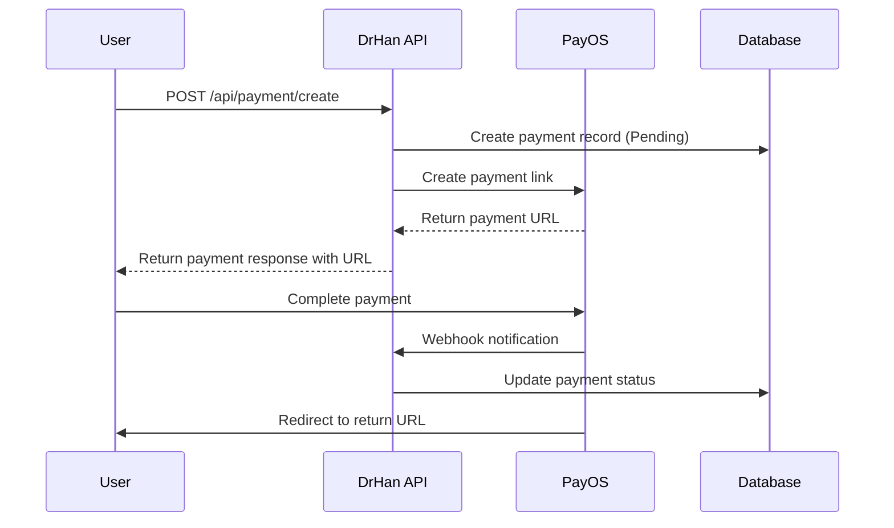
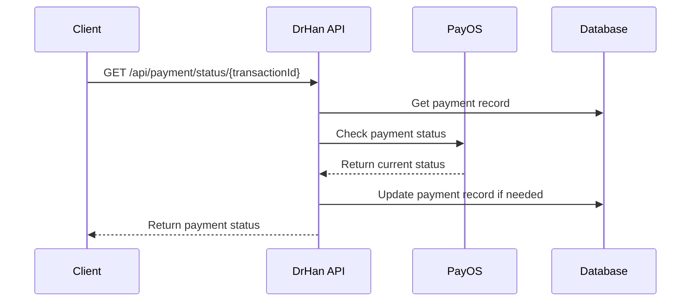

# PayOS Payment Integration API Documentation

## Overview

This document describes the PayOS payment integration for the DrHan application. PayOS is a Vietnamese payment gateway that supports various payment methods including bank transfers and QR code payments.

## Configuration

### Environment Variables

Add the following configuration to your `appsettings.json`:

```json
{
  "PayOS": {
    "ClientId": "your-payos-client-id",
    "ApiKey": "your-payos-api-key", 
    "ChecksumKey": "your-payos-checksum-key",
    "ReturnUrl": "https://yourapp.com/api/payment/return",
    "CancelUrl": "https://yourapp.com/api/payment/cancel"
  }
}
```

## API Endpoints

### 1. Create Payment

Creates a new payment link with PayOS.

**Endpoint:** `POST /api/payment/create`  
**Authorization:** Required (Bearer Token)

#### Request Body

```json
{
  "amount": 100000,
  "description": "Premium subscription payment",
  "currency": "VND",
  "userSubscriptionId": 1,
  "buyerName": "John Doe",
  "buyerEmail": "john@example.com",
  "buyerPhone": "0123456789"
}
```

#### Response

```json
{
  "success": true,
  "message": "Payment created successfully",
  "data": {
    "id": 1,
    "amount": 100000,
    "currency": "VND",
    "transactionId": "1703123456",
    "paymentStatus": "Pending",
    "paymentMethod": "PAYOS",
    "paymentDate": "2024-12-20T10:30:00Z",
    "paymentUrl": "https://pay.payos.vn/web/12345678",
    "userSubscriptionId": 1
  }
}
```

### 2. Get Payment Status

Retrieves the current status of a payment.

**Endpoint:** `GET /api/payment/status/{transactionId}`  
**Authorization:** Required (Bearer Token)

#### Response

```json
{
  "success": true,
  "message": "Payment status retrieved successfully",
  "data": {
    "id": 1,
    "amount": 100000,
    "currency": "VND",
    "transactionId": "1703123456",
    "paymentStatus": "Success",
    "paymentMethod": "PAYOS",
    "paymentDate": "2024-12-20T10:30:00Z",
    "userSubscriptionId": 1
  }
}
```

### 3. Cancel Payment

Cancels a pending payment.

**Endpoint:** `POST /api/payment/cancel/{transactionId}`  
**Authorization:** Required (Bearer Token)

#### Response

```json
{
  "success": true,
  "message": "Payment cancelled successfully",
  "data": true
}
```

### 4. Payment Return Handler

Handles successful payment returns from PayOS.

**Endpoint:** `GET /api/payment/return?orderCode={orderCode}&status={status}`  
**Authorization:** Not required

### 5. Payment Cancel Handler

Handles payment cancellation returns from PayOS.

**Endpoint:** `GET /api/payment/cancel?orderCode={orderCode}`  
**Authorization:** Not required

### 6. Webhook Handler

Receives payment status updates from PayOS.

**Endpoint:** `POST /api/payment/webhook`  
**Authorization:** Not required (secured by signature verification)

#### Webhook Request Body

```json
{
  "code": "00",
  "desc": "success",
  "data": {
    "orderCode": 1703123456,
    "amount": 100000,
    "description": "Premium subscription payment",
    "accountNumber": "12345678",
    "reference": "FT2024122012345",
    "transactionDateTime": "2024-12-20T10:35:00Z",
    "currency": "VND",
    "paymentLinkId": "12345678-abcd-efgh-ijkl-123456789012",
    "code": "00",
    "desc": "success",
    "counterAccountBankId": "970415",
    "counterAccountBankName": "Vietinbank",
    "counterAccountName": "NGUYEN VAN A",
    "counterAccountNumber": "987654321",
    "virtualAccountName": "PAYOS_VIRTUAL",
    "virtualAccountNumber": "123456789"
  },
  "signature": "abcd1234..."
}
```

## Payment Flow

### 1. Standard Payment Flow



### 2. Payment Status Check



## Payment Statuses

- **Pending**: Payment has been created but not yet completed
- **Success**: Payment has been successfully processed
- **Failed**: Payment has failed or been cancelled

## Error Handling

### Common Error Responses

```json
{
  "success": false,
  "message": "Failed to create payment",
  "data": null
}
```

### HTTP Status Codes

- `200 OK`: Request successful
- `400 Bad Request`: Invalid request data
- `401 Unauthorized`: Authentication required
- `404 Not Found`: Payment not found
- `500 Internal Server Error`: Server error

## Security

### Webhook Signature Verification

All webhook requests from PayOS are verified using HMAC-SHA256 signature to ensure authenticity.

### Authentication

Most endpoints require JWT authentication except:
- Webhook endpoint
- Return/cancel handlers

## Testing

### Test Configuration

For testing, use PayOS sandbox credentials:

```json
{
  "PayOS": {
    "ClientId": "test-client-id",
    "ApiKey": "test-api-key",
    "ChecksumKey": "test-checksum-key",
    "ReturnUrl": "http://localhost:5000/api/payment/return",
    "CancelUrl": "http://localhost:5000/api/payment/cancel"
  }
}
```

### Sample Test Cases

1. **Create Payment**: Test payment creation with valid data
2. **Payment Success**: Test webhook handling for successful payments
3. **Payment Failure**: Test webhook handling for failed payments
4. **Payment Cancellation**: Test payment cancellation flow
5. **Invalid Webhook**: Test webhook signature verification

## Monitoring and Logging

All payment operations are logged with appropriate log levels:

- **Information**: Successful operations
- **Warning**: Failed payments, invalid webhooks
- **Error**: System errors, exceptions

Log format includes transaction IDs for easy tracking.

## Dependencies

- **Net.payOS**: Official PayOS .NET SDK
- **Entity Framework**: Database operations
- **AutoMapper**: Object mapping
- **Serilog**: Logging

## Support

For PayOS-specific issues, refer to:
- [PayOS Documentation](https://payos.vn/docs)
- [PayOS Support](https://payos.vn/support)

For DrHan-specific implementation issues, contact the development team. 