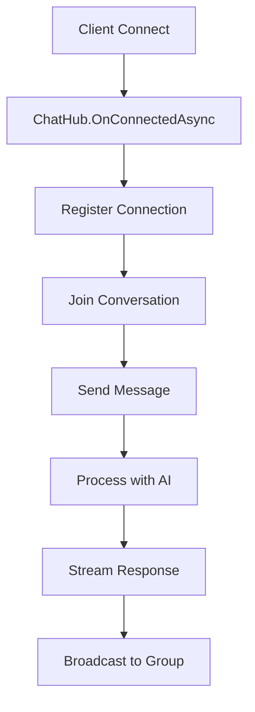

# DrHan Real-Time Chatbot Documentation

## Tổng quan

DrHan Real-Time Chatbot là một hệ thống chat real-time sử dụng SignalR để cung cấp trải nghiệm tương tác trực tiếp với AI. Hệ thống hỗ trợ streaming responses, typing indicators, connection management và emergency detection.

## Kiến trúc hệ thống

### 1. Các thành phần chính

- **ChatHub**: SignalR Hub xử lý kết nối và messaging real-time
- **ChatHubService**: Service logic cho real-time chat
- **Real-time DTOs**: Data transfer objects cho messaging
- **Connection Management**: Quản lý kết nối và trạng thái users

### 2. Flow hoạt động



## Cài đặt và Cấu hình

### 1. Thêm SignalR Package

```xml
<PackageReference Include="Microsoft.AspNetCore.SignalR" Version="8.0.0" />
```

### 2. Cấu hình trong Program.cs

```csharp
// Add SignalR
builder.Services.AddSignalR(options =>
{
    options.EnableDetailedErrors = builder.Environment.IsDevelopment();
    options.HandshakeTimeout = TimeSpan.FromSeconds(30);
    options.KeepAliveInterval = TimeSpan.FromSeconds(15);
    options.ClientTimeoutInterval = TimeSpan.FromSeconds(30);
});

// Map Hub
app.MapHub<ChatHub>("/chat-hub");
```

### 3. Đăng ký Services

```csharp
// Real-time Chat Hub Service
services.AddHttpClient<IChatHubService, ChatHubService>(client =>
{
    client.Timeout = TimeSpan.FromMinutes(2);
    client.DefaultRequestHeaders.Add("User-Agent", "DrHan-RealTimeChat/1.0");
});
```

## API Reference

### 1. SignalR Hub Methods

#### Connection Management

##### OnConnectedAsync()
- **Mô tả**: Xử lý khi client kết nối
- **Response**: `ConnectionEstablished` event với thông tin connection

##### OnDisconnectedAsync(Exception? exception)
- **Mô tả**: Xử lý khi client ngắt kết nối
- **Parameters**: 
  - `exception`: Exception nếu có

#### Conversation Management

##### JoinConversation(string conversationId)
- **Mô tả**: Tham gia vào cuộc trò chuyện
- **Parameters**: 
  - `conversationId`: ID cuộc trò chuyện
- **Response**: `UserJoined` event, `ConversationHistory`

##### LeaveConversation(string conversationId)
- **Mô tả**: Rời khỏi cuộc trò chuyện
- **Parameters**: 
  - `conversationId`: ID cuộc trò chuyện
- **Response**: `UserLeft` event

##### GetOnlineUsers(string conversationId)
- **Mô tả**: Lấy danh sách users online
- **Parameters**: 
  - `conversationId`: ID cuộc trò chuyện
- **Response**: `OnlineUsers` event

#### Messaging

##### SendMessage(RealTimeChatRequestDto request)
- **Mô tả**: Gửi tin nhắn và nhận streaming response
- **Parameters**: 
  - `request`: Yêu cầu chat real-time
- **Response**: Stream of `MessageReceived` events

##### SendTypingIndicator(TypingIndicatorDto typingIndicator)
- **Mô tả**: Gửi typing indicator
- **Parameters**: 
  - `typingIndicator`: Thông tin typing
- **Response**: `TypingIndicator` event broadcast

#### Utility Methods

##### Ping()
- **Mô tả**: Kiểm tra kết nối
- **Response**: `Pong` event

##### GetConnectionInfo()
- **Mô tả**: Lấy thông tin kết nối
- **Response**: `ConnectionInfo` event

### 2. Data Transfer Objects

#### RealTimeChatRequestDto
```csharp
{
    "message": "string",
    "conversationId": "string",
    "language": "vi",
    "category": "general|allergy|mealplan|app_help",
    "enableStreaming": true,
    "userId": "string?"
}
```

#### RealTimeChatMessageDto
```csharp
{
    "messageId": "string",
    "conversationId": "string",
    "senderId": "string",
    "senderName": "string",
    "senderType": "user|assistant|system",
    "content": "string",
    "messageType": "text|typing|system|error|emergency|actions",
    "timestamp": "datetime",
    "isStreaming": false,
    "isStreamComplete": true,
    "metadata": {}
}
```

#### TypingIndicatorDto
```csharp
{
    "conversationId": "string",
    "senderId": "string",
    "senderName": "string",
    "isTyping": true,
    "timestamp": "datetime"
}
```

#### ChatConnectionDto
```csharp
{
    "connectionId": "string",
    "userId": "string",
    "userName": "string",
    "currentConversationId": "string?",
    "connectedAt": "datetime",
    "isOnline": true
}
```

## Client Implementation

### 1. JavaScript/TypeScript Client

#### Kết nối
```javascript
import * as signalR from "@microsoft/signalr";

const connection = new signalR.HubConnectionBuilder()
    .withUrl("/chat-hub", {
        accessTokenFactory: () => getAuthToken()
    })
    .withAutomaticReconnect()
    .build();

await connection.start();
```

#### Tham gia cuộc trò chuyện
```javascript
await connection.invoke("JoinConversation", conversationId);
```

#### Gửi tin nhắn
```javascript
const request = {
    message: "Tôi bị dị ứng sữa, có công thức nào phù hợp không?",
    conversationId: "conv-123",
    language: "vi",
    category: "allergy",
    enableStreaming: true
};

await connection.invoke("SendMessage", request);
```

#### Lắng nghe sự kiện
```javascript
// Nhận tin nhắn
connection.on("MessageReceived", (message) => {
    console.log("Received message:", message);
    displayMessage(message);
});

// Typing indicator
connection.on("TypingIndicator", (indicator) => {
    showTypingIndicator(indicator);
});

// User joined/left
connection.on("UserJoined", (user) => {
    console.log("User joined:", user);
});

connection.on("UserLeft", (user) => {
    console.log("User left:", user);
});

// Errors
connection.on("Error", (error) => {
    console.error("Error:", error);
    showError(error.message);
});
```

#### Gửi typing indicator
```javascript
const typingIndicator = {
    conversationId: "conv-123",
    isTyping: true
};

await connection.invoke("SendTypingIndicator", typingIndicator);

// Stop typing after delay
setTimeout(async () => {
    typingIndicator.isTyping = false;
    await connection.invoke("SendTypingIndicator", typingIndicator);
}, 3000);
```

### 2. React Implementation Example

```tsx
import React, { useState, useEffect, useRef } from 'react';
import * as signalR from "@microsoft/signalr";

interface ChatMessage {
    messageId: string;
    content: string;
    senderType: 'user' | 'assistant' | 'system';
    messageType: string;
    timestamp: Date;
    isStreaming: boolean;
    isStreamComplete: boolean;
}

const RealTimeChat: React.FC = () => {
    const [connection, setConnection] = useState<signalR.HubConnection | null>(null);
    const [messages, setMessages] = useState<ChatMessage[]>([]);
    const [message, setMessage] = useState('');
    const [isConnected, setIsConnected] = useState(false);
    const [isTyping, setIsTyping] = useState(false);
    const conversationId = useRef(`conv-${Date.now()}`);

    useEffect(() => {
        const newConnection = new signalR.HubConnectionBuilder()
            .withUrl("/chat-hub", {
                accessTokenFactory: () => localStorage.getItem('authToken') || ''
            })
            .withAutomaticReconnect()
            .build();

        setConnection(newConnection);

        return () => {
            newConnection.stop();
        };
    }, []);

    useEffect(() => {
        if (connection) {
            connection.start()
                .then(() => {
                    setIsConnected(true);
                    console.log('Connected to ChatHub');

                    // Join conversation
                    connection.invoke("JoinConversation", conversationId.current);

                    // Listen for messages
                    connection.on("MessageReceived", (message: ChatMessage) => {
                        setMessages(prev => {
                            if (message.isStreaming && !message.isStreamComplete) {
                                // Update existing streaming message or add new one
                                const existingIndex = prev.findIndex(m => m.messageId === message.messageId);
                                if (existingIndex >= 0) {
                                    const updated = [...prev];
                                    updated[existingIndex] = message;
                                    return updated;
                                } else {
                                    return [...prev, message];
                                }
                            } else {
                                // Complete message
                                return [...prev, message];
                            }
                        });
                    });

                    // Listen for typing indicators
                    connection.on("TypingIndicator", (indicator: any) => {
                        setIsTyping(indicator.isTyping);
                    });

                    // Listen for errors
                    connection.on("Error", (error: any) => {
                        console.error('Chat error:', error);
                        alert(error.message);
                    });
                })
                .catch(e => console.log('Connection failed: ', e));
        }
    }, [connection]);

    const sendMessage = async () => {
        if (connection && message.trim()) {
            const request = {
                message: message.trim(),
                conversationId: conversationId.current,
                language: "vi",
                category: "general",
                enableStreaming: true
            };

            try {
                await connection.invoke("SendMessage", request);
                setMessage('');
            } catch (e) {
                console.error('Send message failed: ', e);
            }
        }
    };

    const handleTyping = async () => {
        if (connection && isConnected) {
            await connection.invoke("SendTypingIndicator", {
                conversationId: conversationId.current,
                isTyping: true
            });

            // Stop typing after 3 seconds
            setTimeout(async () => {
                await connection.invoke("SendTypingIndicator", {
                    conversationId: conversationId.current,
                    isTyping: false
                });
            }, 3000);
        }
    };

    return (
        <div className="chat-container">
            <div className="chat-header">
                <h3>DrHan AI Chat {isConnected ? '🟢' : '🔴'}</h3>
            </div>
            
            <div className="chat-messages">
                {messages.map((msg, index) => (
                    <div key={`${msg.messageId}-${index}`} 
                         className={`message ${msg.senderType}`}>
                        <div className="message-content">
                            {msg.content}
                            {msg.isStreaming && !msg.isStreamComplete && (
                                <span className="streaming-indicator">▊</span>
                            )}
                        </div>
                        <div className="message-timestamp">
                            {new Date(msg.timestamp).toLocaleTimeString()}
                        </div>
                    </div>
                ))}
                
                {isTyping && (
                    <div className="typing-indicator">
                        DrHan AI đang soạn tin nhắn...
                    </div>
                )}
            </div>
            
            <div className="chat-input">
                <input
                    type="text"
                    value={message}
                    onChange={(e) => setMessage(e.target.value)}
                    onKeyPress={(e) => {
                        if (e.key === 'Enter') {
                            sendMessage();
                        } else {
                            handleTyping();
                        }
                    }}
                    placeholder="Nhập tin nhắn..."
                    disabled={!isConnected}
                />
                <button 
                    onClick={sendMessage} 
                    disabled={!isConnected || !message.trim()}
                >
                    Gửi
                </button>
            </div>
        </div>
    );
};

export default RealTimeChat;
```

## Features

### 1. Streaming AI Responses
- AI responses được stream theo từng chunk
- Real-time typing effect
- Có thể cancel mid-stream
- Progress indicators

### 2. Typing Indicators
- Hiển thị khi user đang gõ
- Auto-expire sau 30 giây
- Broadcast tới tất cả participants

### 3. Connection Management
- Auto-reconnect khi mất kết nối
- Heartbeat/ping-pong
- Online presence tracking
- Connection state management

### 4. Emergency Detection
- Phát hiện từ khóa khẩn cấp
- Gửi cảnh báo ngay lập tức
- Log emergency events
- Escalation to human support

### 5. Conversation Management
- Multiple conversation support
- Conversation history
- Participant management
- Message persistence

## Caching Strategy

### 1. Connection Cache
- Key: `chat_connection:{connectionId}`
- TTL: 24 hours
- Data: ChatConnectionDto

### 2. Message History Cache
- Key: `realtime_messages:{conversationId}`
- TTL: 48 hours
- Data: List<RealTimeChatMessageDto>
- Limit: 100 messages per conversation

### 3. Conversation Participants
- Key: `conversation_participants:{conversationId}`
- TTL: 24 hours
- Data: List<string> (connectionIds)

### 4. Typing Indicators
- Key: `typing_indicator:{conversationId}:{senderId}`
- TTL: 30 seconds
- Data: TypingIndicatorDto

## Performance Considerations

### 1. Streaming Optimization
- Chunk size: 3-4 words
- Delay between chunks: 50ms
- Buffer management for smooth display
- Cancel tokens for cleanup

### 2. Connection Limits
- Max connections per user: 5
- Heartbeat interval: 15 seconds
- Connection timeout: 30 seconds
- Auto-cleanup disconnected users

### 3. Memory Management
- Message history limit: 100 per conversation
- Connection cache cleanup
- Periodic garbage collection
- Resource disposal patterns

## Error Handling

### 1. Connection Errors
```javascript
connection.onclose(async (error) => {
    console.error('Connection lost:', error);
    // Attempt reconnection
    setTimeout(() => startConnection(), 5000);
});

connection.onreconnecting((error) => {
    console.log('Reconnecting...', error);
    showReconnectingIndicator();
});

connection.onreconnected((connectionId) => {
    console.log('Reconnected:', connectionId);
    hideReconnectingIndicator();
    // Rejoin conversations
    rejoinConversations();
});
```

### 2. Message Errors
- Invalid message validation
- AI service failures
- Network timeouts
- Rate limiting

### 3. Emergency Handling
- Automatic escalation
- Admin notifications
- Emergency response protocols
- Incident logging

## Security

### 1. Authentication
- JWT token validation
- User identity verification
- Role-based access control
- Session management

### 2. Authorization
- [Authorize] attribute on Hub
- Connection-level authorization
- Message content filtering
- Rate limiting per user

### 3. Input Validation
- Message content sanitization
- XSS protection
- SQL injection prevention
- Content filtering

## Monitoring và Logging

### 1. Connection Metrics
- Active connections count
- Connection duration
- Reconnection frequency
- Geographic distribution

### 2. Message Metrics
- Messages per second
- Average response time
- Streaming performance
- Error rates

### 3. AI Performance
- Response generation time
- Streaming latency
- Emergency detection accuracy
- User satisfaction metrics

### 4. Logging Events
```csharp
// Connection events
_logger.LogInformation("User {UserId} connected with connection {ConnectionId}", 
    userId, Context.ConnectionId);

// Message events
_logger.LogInformation("Processing real-time message from connection {ConnectionId}: {Message}", 
    connectionId, request.Message);

// Emergency events
_logger.LogCritical("EMERGENCY ALERT - User {UserId} sent emergency message: {Message}", 
    userId, message.Content);
```

## Testing

### 1. Unit Tests
- ChatHubService methods
- Message processing logic
- Emergency detection
- Connection management

### 2. Integration Tests
- SignalR hub functionality
- Database operations
- Cache operations
- AI service integration

### 3. Load Testing
- Concurrent connections
- Message throughput
- Streaming performance
- Resource usage

### 4. End-to-End Tests
- Complete chat flows
- Multi-user scenarios
- Network interruption handling
- Browser compatibility

## Deployment

### 1. Production Configuration
```csharp
builder.Services.AddSignalR(options =>
{
    options.EnableDetailedErrors = false; // Disable in production
    options.HandshakeTimeout = TimeSpan.FromSeconds(15);
    options.KeepAliveInterval = TimeSpan.FromSeconds(10);
    options.ClientTimeoutInterval = TimeSpan.FromSeconds(20);
});
```

### 2. Load Balancing
- Sticky sessions required
- Redis backplane for scale-out
- Health checks for SignalR
- Connection redistribution

### 3. CDN Configuration
- WebSocket support
- Proper headers for SignalR
- Fallback to long polling
- Geographic optimization

## Troubleshooting

### 1. Common Issues

#### Connection Problems
- **Symptom**: Cannot connect to hub
- **Solution**: Check authentication, CORS, firewall

#### Streaming Issues
- **Symptom**: Messages not streaming
- **Solution**: Check client handling, buffer limits

#### Performance Issues
- **Symptom**: Slow responses
- **Solution**: Check AI service, caching, connection count

### 2. Debug Tips
- Enable detailed errors in development
- Use browser network tab for WebSocket
- Check server logs for errors
- Monitor Redis cache performance

## Best Practices

### 1. Client Development
- Always handle connection states
- Implement proper error handling
- Use connection retry logic
- Buffer messages during disconnection

### 2. Server Development
- Validate all inputs
- Use proper logging
- Implement rate limiting
- Handle exceptions gracefully

### 3. Performance
- Use appropriate cache strategies
- Limit message history
- Implement connection pooling
- Monitor resource usage

### 4. Security
- Validate user permissions
- Sanitize message content
- Implement rate limiting
- Log security events

## Tài liệu tham khảo

- [SignalR Documentation](https://docs.microsoft.com/en-us/aspnet/core/signalr/)
- [SignalR JavaScript Client](https://docs.microsoft.com/en-us/aspnet/core/signalr/javascript-client)
- [SignalR Security](https://docs.microsoft.com/en-us/aspnet/core/signalr/security)
- [SignalR Performance](https://docs.microsoft.com/en-us/aspnet/core/signalr/performance) 