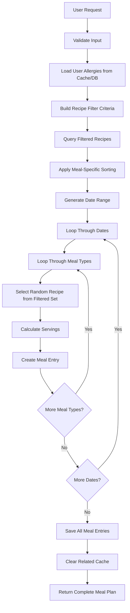

# DrHan Smart Meal Suggestion Service Documentation

## Table of Contents
1. [Overview](#overview)
2. [Service Architecture](#service-architecture)
3. [How It Works](#how-it-works)
4. [API Endpoints](#api-endpoints)
5. [Smart Algorithms](#smart-algorithms)
6. [Data Flow](#data-flow)
7. [Feature Details](#feature-details)
8. [Usage Examples](#usage-examples)
9. [Caching Strategy](#caching-strategy)

---

## Overview

The **Smart Meal Suggestion Service** is an intelligent meal planning system that automatically recommends and generates personalized meal plans based on user preferences, dietary restrictions, allergies, and cooking constraints.

### Key Features
✅ **AI-Powered Recipe Recommendations** - Smart recipe filtering based on multiple criteria  
✅ **Allergy-Safe Meal Planning** - Automatic exclusion of allergen-containing recipes  
✅ **Preference-Based Filtering** - Cuisine type, cooking time, budget constraints  
✅ **Meal Type Optimization** - Different algorithms for breakfast, lunch, dinner, snacks  
✅ **Bulk Operations** - Generate entire meal plans or fill specific meal slots  
✅ **Intelligent Caching** - High-performance recipe recommendations  
✅ **Flexible Generation** - Create new plans or enhance existing ones  

---

## Service Architecture

### Core Components

```
┌─────────────────────────────────────────────────────────────────┐
│                    Smart Meal Plan Service                     │
├─────────────────────────────────────────────────────────────────┤
│ ┌─────────────────┐ ┌─────────────────┐ ┌─────────────────┐    │
│ │  Recipe Filter  │ │ Allergy Checker │ │ Preference      │    │
│ │  Engine         │ │                 │ │ Matcher         │    │
│ └─────────────────┘ └─────────────────┘ └─────────────────┘    │
│ ┌─────────────────┐ ┌─────────────────┐ ┌─────────────────┐    │
│ │ Smart Generator │ │ Cache Manager   │ │ Meal Type       │    │
│ │                 │ │                 │ │ Optimizer       │    │
│ └─────────────────┘ └─────────────────┘ └─────────────────┘    │
└─────────────────────────────────────────────────────────────────┘
                                │
                                ▼
┌─────────────────────────────────────────────────────────────────┐
│                    Static Query Engine                         │
├─────────────────────────────────────────────────────────────────┤
│ • BuildMealPlanFilter()     - Complex recipe filtering         │
│ • BuildMealPlanOrderBy()    - Meal-specific sorting            │
│ • BuildMealPlanIncludes()   - Optimized data loading           │
│ • GetRecommendedRecipeCount() - Dynamic result sizing          │
└─────────────────────────────────────────────────────────────────┘
```

### Service Dependencies
- **IUnitOfWork** - Data access and transactions
- **IMapper** - Entity to DTO mappings
- **ICacheService** - Performance optimization
- **ICacheKeyService** - Cache key management
- **ILogger** - Comprehensive logging

---

## How It Works

### 1. **Smart Meal Plan Generation Flow**

```
User Request with Preferences
           ↓
┌─────────────────────────┐
│ Validate Request        │
│ • Check date ranges     │
│ • Verify family access  │
│ • Validate plan type    │
└─────────────────────────┘
           ↓
┌─────────────────────────┐
│ Load User Allergies     │
│ • Query user allergies  │
│ • Cache for 2 hours     │
│ • Handle allergen IDs   │
└─────────────────────────┘
           ↓
┌─────────────────────────┐
│ Filter Recipes by       │
│ Preferences & Allergies │
│ • Cuisine type filter   │
│ • Cooking time limits   │
│ • Budget constraints    │
│ • Allergy-safe recipes  │
└─────────────────────────┘
           ↓
┌─────────────────────────┐
│ Generate Meal Entries   │
│ • Loop through dates    │
│ • Select meal types     │
│ • Smart recipe selection│
│ • Calculate servings    │
└─────────────────────────┘
           ↓
┌─────────────────────────┐
│ Save & Return Plan      │
│ • Persist meal plan     │
│ • Clear related cache   │
│ • Return complete DTO   │
└─────────────────────────┘
```

### 2. **Recipe Filtering Algorithm**

The service uses a sophisticated multi-criteria filtering system:

#### **Allergy Safety Filter**
```csharp
// Excludes recipes containing user allergens
!recipe.RecipeAllergens.Any(ra => userAllergies.Contains(ra.AllergenId ?? 0))
```

#### **Cooking Time Filter**  
```csharp
// Respects maximum cooking time preference
!preferences.MaxCookingTime.HasValue || 
recipe.CookTimeMinutes <= preferences.MaxCookingTime.Value
```

#### **Cuisine Type Filter**
```csharp
// Matches preferred cuisine types
!preferences.CuisineTypes.Any() || 
preferences.CuisineTypes.Contains(recipe.CuisineType)
```

#### **Meal Type Compatibility**
```csharp
// Smart meal type matching
recipe.MealType.Contains(mealType) ||
recipe.Name.ToLower().Contains(mealType.ToLower()) ||
recipe.Description.ToLower().Contains(mealType.ToLower())
```

### 3. **Meal-Specific Optimization**

Each meal type has optimized sorting logic:

#### **Breakfast** 🌅
- **Priority**: Speed (PrepTime)
- **Logic**: Quick breakfast recipes first
- **Serving**: 1 serving
- **Weight**: 20% of daily nutrition

#### **Lunch** 🍽️
- **Priority**: Total Time (Prep + Cook)  
- **Logic**: Portable, moderate complexity
- **Serving**: 1 serving
- **Weight**: 30% of daily nutrition

#### **Dinner** 🌃
- **Priority**: Quality (Rating Average)
- **Logic**: Main meal, complex recipes allowed
- **Serving**: 2 servings (leftovers)
- **Weight**: 40% of daily nutrition

#### **Snack** 🥨
- **Priority**: Minimal Prep Time
- **Logic**: Quick, healthy options
- **Serving**: 1 serving  
- **Weight**: 10% of daily nutrition

---

## API Endpoints

### Core Smart Generation

#### **Generate Complete Smart Meal Plan**
```http
POST /api/mealplans/generate-smart
```

**Request Body:**
```json
{
  "name": "Weekly Meal Plan",
  "startDate": "2024-01-15",
  "endDate": "2024-01-21", 
  "planType": "Personal",
  "familyId": null,
  "preferences": {
    "cuisineTypes": ["Italian", "Asian"],
    "maxCookingTime": 45,
    "budgetRange": "medium",
    "preferredMealTypes": ["Breakfast", "Lunch", "Dinner"],
    "includeLeftovers": true,
    "varietyMode": true
  }
}
```

**Response:**
```json
{
  "isSucceeded": true,
  "data": {
    "id": 123,
    "name": "Weekly Meal Plan",
    "startDate": "2024-01-15",
    "endDate": "2024-01-21",
    "totalMeals": 21,
    "mealEntries": [
      {
        "id": 456,
        "mealDate": "2024-01-15",
        "mealType": "Breakfast",
        "mealName": "Italian Pancakes",
        "servings": 1,
        "recipeId": 789
      }
    ]
  },
  "message": "Smart meal plan generated successfully with 21 meals"
}
```

#### **Get Recipe Recommendations**
```http
POST /api/mealplans/recommendations?mealType=dinner
```

**Request Body:**
```json
{
  "cuisineTypes": ["Mexican", "Italian"],
  "maxCookingTime": 60,
  "budgetRange": "high",
  "varietyMode": true
}
```

**Response:**
```json
{
  "isSucceeded": true,
  "data": [101, 102, 103, 104, 105],
  "message": "Found 5 recommended recipes"
}
```

#### **Generate Smart Meals for Existing Plan**
```http
POST /api/mealplans/{mealPlanId}/generate-smart-meals
```

**Request Body:**
```json
{
  "preferences": {
    "cuisineTypes": ["Asian"],
    "maxCookingTime": 30
  },
  "targetDates": ["2024-01-16", "2024-01-17"],
  "mealTypes": ["Lunch", "Dinner"],
  "replaceExisting": false,
  "preserveFavorites": true
}
```

### Utility Endpoints

#### **Get Smart Generation Options**
```http
GET /api/mealplans/smart-generation/options
```

**Response:**
```json
{
  "isSucceeded": true,
  "data": {
    "availableCuisineTypes": ["Italian", "Asian", "Mexican", "American"],
    "budgetRangeOptions": ["low", "medium", "high"],
    "mealTypeOptions": ["Breakfast", "Lunch", "Dinner", "Snack"],
    "planTypeOptions": ["Personal", "Family"],
    "fillPatternOptions": ["rotate", "random", "same"],
    "cookingTimeRange": {
      "minCookingTime": 5,
      "maxCookingTime": 180,
      "defaultMaxCookingTime": 45,
      "recommendedTimeRanges": [15, 30, 45, 60, 90]
    }
  }
}
```

#### **Bulk Fill Meals**
```http
POST /api/mealplans/bulk-fill
```

**Request Body:**
```json
{
  "mealPlanId": 123,
  "mealType": "breakfast",
  "fillPattern": "rotate",
  "recipeIds": [101, 102, 103],
  "targetDates": ["2024-01-15", "2024-01-16", "2024-01-17"]
}
```

---

## Smart Algorithms

### 1. **Recipe Selection Algorithm**

#### **Random Selection with Quality Bias**
```csharp
private Recipe SelectRandomRecipe(List<Recipe> recipes)
{
    // Simple random selection from pre-filtered, sorted list
    var random = new Random();
    return recipes[random.Next(recipes.Count)];
}
```

#### **Pattern-Based Selection**
```csharp
private int SelectRecipeByPattern(List<int> recipeIds, string pattern, DateOnly date)
{
    return pattern.ToLower() switch
    {
        "rotate" => recipeIds[date.DayNumber % recipeIds.Count], // Cycle through recipes
        "random" => recipeIds[new Random().Next(recipeIds.Count)], // Random selection
        "same" => recipeIds.First(), // Use same recipe
        _ => recipeIds.First()
    };
}
```

### 2. **Serving Calculation**
```csharp
private decimal CalculateServings(string mealType)
{
    return mealType.ToLower() switch
    {
        "breakfast" => 1,  // Individual portions
        "lunch" => 1,      // Individual portions  
        "dinner" => 2,     // Plan for leftovers
        "snack" => 1,      // Individual portions
        _ => 1
    };
}
```

### 3. **Meal Type Weights**
```csharp
private readonly Dictionary<string, double> _mealTypeWeights = new()
{
    { "Breakfast", 0.20 }, // 20% - Light, quick meals
    { "Lunch", 0.30 },     // 30% - Moderate, portable
    { "Dinner", 0.40 },    // 40% - Main meal, complex
    { "Snack", 0.10 }      // 10% - Light, healthy
};
```

---

## Data Flow

### Complete Generation Process



### Error Handling Flow

```
Recipe Filtering Error
         ↓
┌─────────────────────┐
│ Log Error Details   │
└─────────────────────┘
         ↓
┌─────────────────────┐
│ Fallback to Simple  │
│ Recipe Query        │
│ • Order by rating   │
│ • Take top 20       │
│ • Cache result      │
└─────────────────────┘
         ↓
Continue with Generation
```

---

## Feature Details

### 1. **Allergy Management**

#### **User Allergy Loading**
```csharp
private async Task<List<int>> GetUserAllergiesAsync(int userId)
{
    // 1. Check cache first (2-hour expiration)
    // 2. Query database if cache miss
    // 3. Async cache update for performance
    // 4. Return allergen IDs for filtering
}
```

#### **Allergy-Safe Recipe Filtering**
- Excludes recipes containing user's allergens
- Uses recipe-allergen relationship table
- Cached for performance optimization
- Fallback to empty list on errors

### 2. **Preference Matching**

#### **Cuisine Type Filtering**
- Supports multiple cuisine preferences  
- Exact string matching on recipe cuisine type
- Empty list means "all cuisines accepted"

#### **Cooking Time Constraints**
- Filters by maximum cooking time
- Null cooking times treated as acceptable
- Useful for busy schedules

#### **Budget Range Considerations**
- "low", "medium", "high" budget categories
- Currently used for filtering logic
- Ready for price-based filtering

### 3. **Meal Plan Types**

#### **Personal Plans**
- Individual user meal planning
- Cannot have family association
- Optimized for single portions

#### **Family Plans**  
- Requires family ID association
- Validates family membership
- Scales servings appropriately

### 4. **Smart Generation Options**

#### **Variety Mode**
- Ensures meal diversity
- Prevents recipe repetition
- Balances nutrition across meals

#### **Include Leftovers**
- Plans for dinner leftovers
- Optimizes portion calculations
- Reduces food waste

---

## Usage Examples

### 1. **Simple Weekly Meal Plan**

```javascript
// Generate a basic weekly meal plan
const request = {
  name: "Simple Week",
  startDate: "2024-01-15",
  endDate: "2024-01-21",
  planType: "Personal",
  preferences: {
    maxCookingTime: 30,
    preferredMealTypes: ["Breakfast", "Dinner"],
    varietyMode: true
  }
};

const response = await fetch('/api/mealplans/generate-smart', {
  method: 'POST',
  headers: { 'Content-Type': 'application/json' },
  body: JSON.stringify(request)
});
```

### 2. **Allergy-Conscious Meal Planning**

```javascript
// The service automatically excludes allergen-containing recipes
// User allergies are loaded from the database automatically
const request = {
  name: "Allergy-Safe Week",
  startDate: "2024-01-15", 
  endDate: "2024-01-21",
  planType: "Personal",
  preferences: {
    cuisineTypes: ["Italian"], // Safe cuisine choice
    maxCookingTime: 45,
    budgetRange: "medium"
  }
};
```

### 3. **Family Meal Planning**

```javascript
const request = {
  name: "Family Dinners",
  startDate: "2024-01-15",
  endDate: "2024-01-21", 
  planType: "Family",
  familyId: 123,
  preferences: {
    preferredMealTypes: ["Dinner"],
    includeLeftovers: true,
    varietyMode: true,
    maxCookingTime: 60
  }
};
```

### 4. **Quick Breakfast Planning**

```javascript
// Get breakfast recommendations
const preferences = {
  cuisineTypes: ["American"],
  maxCookingTime: 15,
  preferredMealTypes: ["Breakfast"]
};

const response = await fetch('/api/mealplans/recommendations?mealType=breakfast', {
  method: 'POST',
  body: JSON.stringify(preferences)
});
```

### 5. **Bulk Fill Operations**

```javascript
// Fill all breakfast slots with rotating recipes
const bulkRequest = {
  mealPlanId: 123,
  mealType: "breakfast",
  fillPattern: "rotate",
  recipeIds: [101, 102, 103],
  targetDates: [] // Empty = all dates in plan
};

await fetch('/api/mealplans/bulk-fill', {
  method: 'POST',
  body: JSON.stringify(bulkRequest)
});
```

---

## Caching Strategy

### 1. **Multi-Level Caching**

#### **User Allergies Cache**
- **Duration**: 2 hours
- **Key**: `user_{userId}_allergies`
- **Purpose**: Avoid repeated allergy queries
- **Invalidation**: User profile updates

#### **Filtered Recipes Cache**
- **Duration**: 30 minutes
- **Key**: `recipes_filtered_{mealType}_{preferencesHash}`
- **Purpose**: Cache expensive filtering operations
- **Invalidation**: Recipe database updates

#### **Meal Plan Cache**
- **Duration**: Variable
- **Key**: `mealplan_{mealPlanId}`
- **Purpose**: Cache complete meal plan data
- **Invalidation**: Meal plan modifications

### 2. **Cache Key Strategy**

```csharp
// Hierarchical cache keys for efficient invalidation
private string GeneratePreferencesHash(MealPlanPreferencesDto preferences, List<int> userAllergies, string mealType)
{
    var cuisineTypes = string.Join(",", preferences?.CuisineTypes?.OrderBy(x => x) ?? []);
    var hashSource = $"{mealType}_{cuisineTypes}_{preferences?.MaxCookingTime}_{preferences?.BudgetRange}_{string.Join(",", userAllergies.OrderBy(x => x))}";
    return hashSource.GetHashCode().ToString();
}
```

### 3. **Cache Invalidation**

```csharp
private async Task InvalidateMealPlanCacheAsync(int mealPlanId, int userId)
{
    // Specific meal plan cache
    await _cacheService.RemoveAsync($"mealplan_{mealPlanId}");
    
    // User's meal plan list cache pattern
    await _cacheService.RemoveByPatternAsync($"user_{userId}_mealplans_*");
}
```

---

## Performance Optimizations

### 1. **Database Query Optimization**

#### **Selective Includes**
```csharp
var includes = query => query
    .Include(r => r.RecipeAllergens)          // For allergy filtering
    .Include(r => r.RecipeAllergenFreeClaims) // For dietary claims
    .Include(r => r.RecipeNutritions)         // For nutrition info
    .Include(r => r.RecipeImages.Take(1));    // Only first image
```

#### **Efficient Filtering**
- Complex filters built as expressions
- Executed at database level
- Minimal data transfer
- Indexed columns utilized

### 2. **Async Cache Operations**

```csharp
// Fire-and-forget cache updates
_ = Task.Run(async () =>
{
    try
    {   
        await _cacheService.SetAsync(cacheKey, result, expiration);
    }
    catch (Exception ex) 
    {
        _logger.LogWarning(ex, "Cache update failed");
    }
});
```

### 3. **Fallback Mechanisms**

```csharp
// Graceful degradation on complex query failures
catch (Exception ex)
{
    _logger.LogError(ex, "Complex filtering failed");
    return await GetFallbackRecipes(mealType); // Simple, reliable query
}
```

---

## Error Handling

### 1. **Comprehensive Error Scenarios**

#### **No Recipes Found**
```csharp
if (recipesByMealType.Values.All(recipes => !recipes.Any()))
{
    var errorMessage = BuildNoRecipesErrorMessage(preferences, missingCuisines, missingMealTypes);
    return response.SetErrorResponse("NoRecipesFound", errorMessage);
}
```

#### **Authorization Failures**
```csharp
if (mealPlan == null || mealPlan.UserId != userId)
{
    return response.SetErrorResponse("Authorization", "Meal plan not found or access denied");
}
```

#### **Invalid Family Associations**
```csharp
if (request.PlanType?.ToLower() == "family" && !request.FamilyId.HasValue)
{
    return response.SetErrorResponse("PlanType", "Family meal plans must be associated with a family");
}
```

### 2. **Detailed Error Messages**

```csharp
private string BuildNoRecipesErrorMessage(MealPlanPreferencesDto preferences, List<string> missingCuisines, List<string> missingMealTypes)
{
    var errorParts = new List<string>();
    
    if (preferences?.CuisineTypes?.Any() == true)
        errorParts.Add($"No recipes found for cuisine types: {string.Join(", ", preferences.CuisineTypes)}");
    
    if (missingMealTypes.Any())
        errorParts.Add($"No recipes available for meal types: {string.Join(", ", missingMealTypes)}");
    
    if (preferences?.MaxCookingTime.HasValue == true)
        errorParts.Add($"with maximum cooking time of {preferences.MaxCookingTime} minutes");
    
    return string.Join(". ", errorParts) + ". Try relaxing your constraints.";
}
```

---

## Conclusion

The **Smart Meal Suggestion Service** provides an intelligent, comprehensive solution for automated meal planning with:

✅ **Sophisticated Filtering** - Multi-criteria recipe selection  
✅ **Allergy Safety** - Automatic allergen exclusion  
✅ **Performance Optimization** - Multi-level caching strategy  
✅ **Flexible Generation** - Complete plans or targeted meal filling  
✅ **Error Resilience** - Graceful fallbacks and detailed error messages  
✅ **User-Centric Design** - Personalized preferences and constraints  

The service balances complexity with performance, providing users with personalized, safe, and delicious meal suggestions while maintaining excellent system performance through intelligent caching and optimized database operations. 